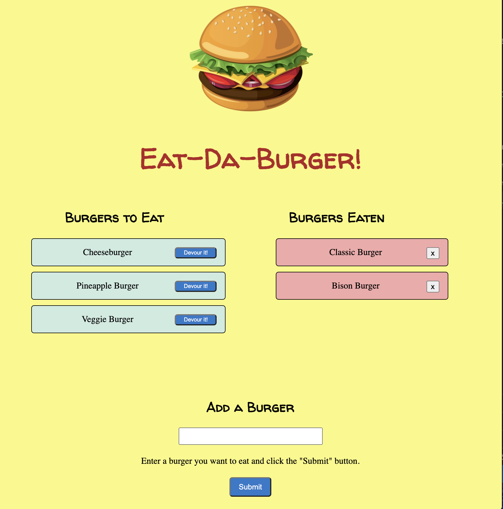

# Eat-Da-Burger Fullstack Application

Explore the [project page](https://github.com/cynthiwu/eat-burger)

View it live on [Heroku]()

## Table of Contents
- [About The Project](#about-the-project)
    - [Built With](#built-with)
- [Installation](#installation)
- [Usage](#usage)
  - [Demo](#demo)
- [Contributing](#contributing)
- [License](#license)
- [Contact](#contact)


## About The Project

The goal of this project was to create a "burger logging" application using MySQL, Node, Express, Handlebars, and an ORM.

<hr>



<hr>

### Built With

This project was built using:

* JavaScript
* jQuery
* [Node.js](https://nodejs.org/api/fs.html)
* [MySQL](https://www.mysql.com/)
* [MySQL Workbench](https://www.mysql.com/products/workbench/)
* [Express.js](https://expressjs.com/)

## Installation

While not necessary to run the program via the live link above, you may get a local copy up and running by following these simple steps:

1. Clone the repo
```sh
git clone git@github.com:cynthiwu/eat-burger.git 
```

2. Install NPM packages (i.e., Inquirer)
```sh
npm install
```

## Usage

This project can be used to add, track and remove burgers they'd like to eat! A user can submit a new burger name, which will displayed in the "Burgers to Eat" section of the page. Each burger has a "Devour it!" button which can be clicked to be moved to the "Burgers Eaten" section on the right-hand side of the page.All data is stored on a database, devloured or not. 

### Demo

Watch the video below to see how the program works.


## Contributing

Contributions are what make the open source community such an amazing place to  learn, inspire, and create. Any contributions you make are **greatly appreciated**.

1. Fork the Project
2. Create your Feature Branch (`git checkout -b feature/AmazingFeature`)
3. Commit your Changes (`git commit -m 'Add some AmazingFeature'`)
4. Push to the Branch (`git push origin feature/AmazingFeature`)
5. Open a Pull Request

## License

None

## Contact

Cynthia Wu - [@cynthia21wu](https://twitter.com/cynthia21wu) - cynthia21wu@gmail.com

Project Link: [https://github.com/cynthiwu/note-taker](https://github.com/cynthiwu/eat-burger)
Live Link:[]()
